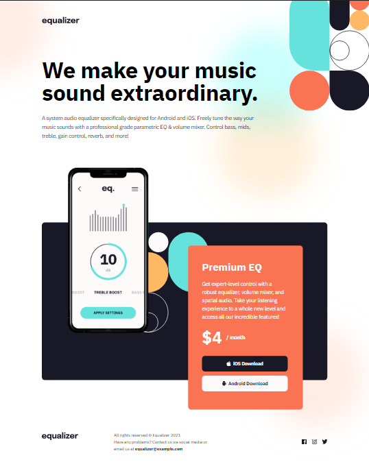
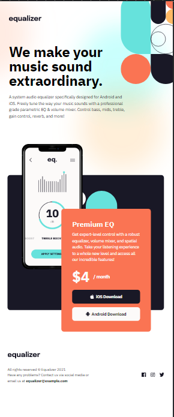

# Equalizer landing page

## Table of contents

- [Overview](#overview)
  - [The challenge](#the-challenge)
  - [Screenshot](#screenshot)
  - [Links](#links)
- [My process](#my-process)
  - [Built with](#built-with)
  - [What I learned](#what-i-learned)
  - [Continued development](#continued-development)
  - [Useful resources](#useful-resources)

## Overview

If you leave me some feedback, please leave me a request for a project of yours that you want me to have a look at. I'll be more than happy to help.

I learned a lot and found many useful resources whilst doing this project. I will share some of them below.

This is the first landing page challenge that I have done via Frontend Mentor. I spent a lot longer than I initially intended on this project.

This is the first time that I have ever done a mobile first responsive design. If you have any tips on how to improve please let me know.

This is the first time that I have tried so hard to make a website accessible. Any feedback would be great. I will list some of the issues below.

#### Issues

1. When I used the <article> element was that use correct? Or, should I have used a <section> element?
2. Was I right to use the <header> element within the <article> element?
3. Should I have used the <address> element within the <footer>?
4. Instead of using a reset CSS stylesheet I just added the styles that I wanted to reset manually. What's your opinions on reset sheets?
5. I had trouble getting the background image to be displayed properly. I think it doesn't stand out enough and the positioning is wrong. Any tips on how to fix this?
6. The <article> background color looks different from the design. What do you think? (I'm partially color blind).
7. I used focus-visible styles. Did I do it correctly?
8. I used the min and max CSS values. What do you think?
9. Should I have used the <button> element or the <a> element for the navigation icons within the <footer>?
10. How does my page fare on a screen reader?
11. Is my useage of ARIA labels correct?
12. Is my useage of the role attribute correct?
13. Was I correct to use the <nav> element for the icons in the <footer>?
14. Aaaaannnnnnyyyyyy help with accessibility would be awesome! 

### The challenge

#### Frontend Mentor's requirements
Users should be able to:

- View the optimal layout depending on their device's screen size
- See hover states for interactive elements

#### Personal challenges
User's should be able to:

- Use a screen reader to view the site.

### Screenshot

### Links

- Solution URL: [https://github.com/arfarobs/equalizer-landing-page](https://github.com/arfarobs/equalizer-landing-page)
- Live Site URL: [https://arfarobs.github.io/equalizer-landing-page/](https://arfarobs.github.io/equalizer-landing-page/)

## My process

1. Sketch a rough DOM tree.
2. Write the HTML.
3. Style it for mobile.
4. Style it for tablet.
5. Style it for desktop.
6. Try to overcomplicate everything. Waste a lot of time doing so.
7. Go back to plan A and keep it simple.
8. Make a mental note to self. "Learn from mistakes. Don't do step 6 ever again".
9. Refactor code.
10. Add focus styles and hover styles.
11. Add accessibility.
12. Upload solution and pray for feedback :D !

### Built with

- Semantic HTML5 markup
- CSS
- Flexbox (small amount of)
- CSS Grid
- Mobile-first workflow

### What I learned

1. I used the filter property to style the icons in the <footer>. I found a great resource that allows you to enter a hex color and then returns a filter value to match that color. Resource listed below.
2. I made use of the min and max CSS values which are really good for getting smooth responsive styles. I found a website that will do a lot of the calculations for you. Website listed below.
3. I used the ALLY checklist for the first time. I found it quite helpful when addressing accessibility issues. Link below.

### Continued development

Improve accessibility.
Improve responsive design.

### Useful resources

- [responsive size calculator](https://websemantics.uk/tools/responsive-font-calculator/) - Great for semantic fonts and sizing in general.
- [Convert hex codes to filter values](https://codepen.io/sosuke/pen/Pjoqqp) - Brilliant for changing the color of images when you want to add hover effects.
- [ALLY checklist](https://www.a11yproject.com/checklist/) - Great tool for creating an accessible website.